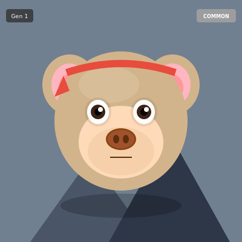

# 🐵 ForkMonkey

<div align="center">

### **Your Digital Pet That Lives Forever on GitHub**

[](https://roeiba.github.io/forkMonkey/?utm_source=readme&utm_medium=github&utm_campaign=hero)
[](https://github.com/roeiba/forkMonkey/fork)
[](https://github.com/roeiba/forkMonkey)

**Fork a monkey 🐵 → Watch it evolve with AI 🤖 → Breed rare traits 🧬 → Free forever 💸**

<br>

| ⚡ Takes 30 Seconds | 🤖 Evolves Daily | 💸 100% Free | 🌳 Join 20+ Monkeys |
|:------------------:|:----------------:|:------------:|:-------------------:|

<br>

[**🎮 See Live Demo**](https://roeiba.github.io/forkMonkey/?utm_source=readme&utm_medium=github&utm_campaign=nav) • [**🍴 Fork Your Monkey**](https://github.com/roeiba/forkMonkey/fork) • [**📖 How It Works**](#how-it-works)

</div>

---

## 🎬 What Is This?

Imagine **Tamagotchi** meets **GitHub** meets **AI**.

Your ForkMonkey is a digital pet that:
- 🏠 **Lives in your GitHub repo** (you truly own it)
- 🧬 **Evolves every night** while you sleep (AI decides the changes)
- 👶 **Breeds through forking** (create children with inherited traits)
- 🏆 **Competes on a leaderboard** (rarity rankings across all monkeys)
- 💰 **Costs $0 forever** (runs on GitHub's free tier)

> *"I bred a LEGENDARY golden monkey on day 23!"* — Early Adopter

---

## 👀 See It In Action

<div align="center">

### 🎮 [**LIVE DEMO →**](https://roeiba.github.io/forkMonkey/?utm_source=readme&utm_medium=github&utm_campaign=demo_section)

*View the dashboard, leaderboard, family tree, and community gallery!*

</div>

---

## 🚀 Get Your Monkey in 30 Seconds

### Step 1: Fork This Repo
Click the big green button below 👇

<div align="center">

[](https://github.com/roeiba/forkMonkey/fork)

</div>

### Step 2: Enable GitHub Actions
Go to **Actions** tab → Click **"I understand my workflows, go ahead and enable them"**

### Step 3: Run the Genesis Workflow
**Actions** → **"Initialize New Monkey"** → **"Run workflow"** → Wait 30 seconds 🐵

### Step 4: Meet Your Monkey!
Your monkey is born! Check the README or visit `https://YOUR-USERNAME.github.io/forkMonkey/`

---

## 🧬 Your Monkey

<!-- MONKEY_DISPLAY_START -->
<div align="center">



</div>
<!-- MONKEY_DISPLAY_END -->

<!-- MONKEY_STATS_START -->
| Generation | Age | Mutations | Rarity Score |
|:----------:|:---:|:---------:|:------------:|
| 2 | 62 days | 9 | 10.0/100 |
<!-- MONKEY_STATS_END -->

---

## ✨ Features

### 🤖 Free AI Evolution
Every night, GPT-4o (via GitHub Models) evolves your monkey. **No API key needed!**

```
Day 1: 🐵 Born with random DNA
Day 7: 🐵 Grew sunglasses (RARE!)
Day 30: 🐵 Changed to golden color
Day 100: 🐵 Completely unique creature
```

### 🧬 Genetic Breeding
Fork any monkey to create a child that inherits traits:
- 50% from parent
- 50% random mutations
- Rare traits can be inherited!

### 🏆 Rarity System
| Tier | Chance | Examples |
|------|--------|----------|
| ⚪ Common | 60% | Basic colors |
| 💚 Uncommon | 25% | Accessories |
| 💙 Rare | 10% | Unique patterns |
| 🦄 Legendary | 5% | Ultra-rare combos |

### 💎 Extinct Traits (Gen-Locked)
Some legendary traits are **only available in early generations** — they become EXTINCT forever:

| Trait | Max Generation | Status |
|-------|:--------------:|:------:|
| 🏆 Genesis Aura | Gen 1 only | 🔒 |
| 👑 Alpha Crown | Gen 1-3 | 🔒 |
| ✨ Founders Badge | Gen 1-5 | 🔒 |
| 🌟 Pioneer Glow | Gen 1-10 | 🔒 |

**Fork early to get these ultra-rare traits before they're gone forever!**

### 🔥 Evolution Streaks
Keep your monkey evolving daily to build streaks and unlock rewards:

| Streak | Reward |
|--------|--------|
| 🏅 7 days | Week Warrior badge |
| ⚔️ 14 days | Fortnight Fighter |
| 💎 30 days | Diamond Hands |
| 💯 100 days | Century Legend |

### 🌳 Family Tree
Watch the network grow as monkeys breed across GitHub. Your lineage matters!

### 🏅 Achievements
Unlock 12 achievements: First Hatch, Week Warrior, Diamond Hands, and more!

---

## 🏆 Leaderboard Preview

| Rank | Monkey | Rarity |
|:----:|--------|:------:|
| 🥇 | richinseattle/forkMonkey | 40.0 |
| 🥈 | springsoftware-io/forkMonkey | 35.0 |
| 🥉 | loukasgr/forkMonkey | 31.7 |
| ... | **Your monkey could be here!** | ??? |

[**View Full Leaderboard →**](https://roeiba.github.io/forkMonkey/?utm_source=readme&utm_medium=github&utm_campaign=leaderboard#leaderboard)

---

## 💡 How It Works

```
┌─────────────────────────────────────────────────────────────┐
│  1. FORK     →    2. EVOLVE    →    3. BREED    →   4. WIN │
│                                                             │
│  🍴 Fork       🤖 AI evolves     👶 Others fork    🏆 Climb │
│  the repo     it every night    your monkey     leaderboard│
└─────────────────────────────────────────────────────────────┘
```

**The secret sauce:**
- **GitHub Actions** = The heartbeat (runs daily, free)
- **GitHub Models** = The brain (GPT-4o, free)
- **GitHub Pages** = The face (hosting, free)
- **Git commits** = The memory (history, free)

**Total cost: $0/month forever** 🎉

---

## 🛠️ Development

<details>
<summary>Click to expand developer docs</summary>

### Local Setup

```bash
# Install dependencies
pip install -r requirements.txt

# Initialize your monkey
python src/cli.py init

# View in web interface
./start_web.sh

# Evolve monkey manually
python src/cli.py evolve --ai

# Show monkey stats
python src/cli.py show

# Generate shareable tweet
python src/cli.py share

# Run tests
pytest tests/
```

### Project Structure

```
forkMonkey/
├── .github/workflows/      # GitHub Actions (daily evolution, deploy)
├── src/                    # Python backend (genetics, AI, CLI)
├── web/                    # Frontend dashboard
├── monkey_data/            # Your monkey's DNA and history
└── promotion/              # Marketing materials
```

### Optional: Use Claude Instead of GPT-4o

1. Get API key from [console.anthropic.com](https://console.anthropic.com)
2. Add secret: `ANTHROPIC_API_KEY`
3. Add variable: `AI_PROVIDER` = `claude`

</details>

---

## 🍴 This Monkey Wants Siblings!

<div align="center">

### **Fork this repo to create a child monkey!**

Your child inherits traits from this monkey + gets random mutations.

<!-- LINEAGE_STATS_START -->
🧬 **Lineage Stats:** This monkey has inspired a growing family tree!
<!-- LINEAGE_STATS_END -->

<!-- BREEDING_BOOST_START -->
⚡ **First 5 forks get +15% legendary trait inheritance!**
<!-- BREEDING_BOOST_END -->

**Will you breed the next Legendary?** 🦄

<br>

[](https://github.com/roeiba/forkMonkey/fork)

<br>

*"Best GitHub project I've seen this year"* — Developer

</div>

---

## 🌟 Join the Community

- ⭐ **Star this repo** to follow updates
- 🍴 **Fork to adopt** your own monkey
- 🐦 **Share on Twitter** with #ForkMonkey
- 💬 **Open an issue** with questions or ideas

---

## 📜 License

MIT License — Fork, breed, and evolve freely!

---

<div align="center">

### **Your monkey is unique. Your monkey is alive. Your monkey is forever on GitHub.** 

<br>

[](https://github.com/roeiba/forkMonkey/fork)

<br>

**[🎮 Live Demo](https://roeiba.github.io/forkMonkey/?utm_source=readme&utm_medium=github&utm_campaign=footer)** • **[🍴 Fork Now](https://github.com/roeiba/forkMonkey/fork)** • **[⭐ Star](https://github.com/roeiba/forkMonkey)**

</div>
